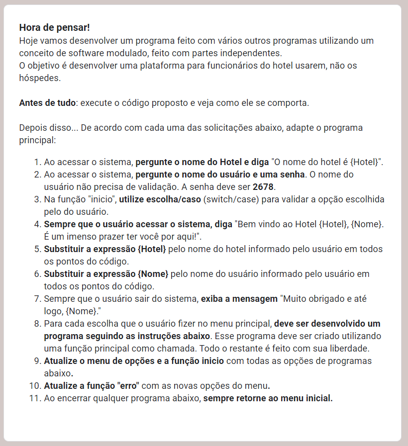
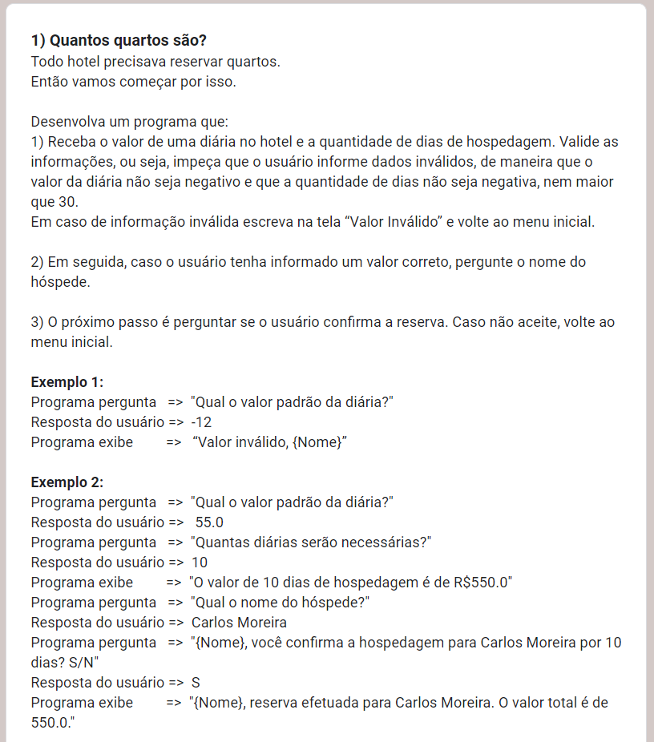
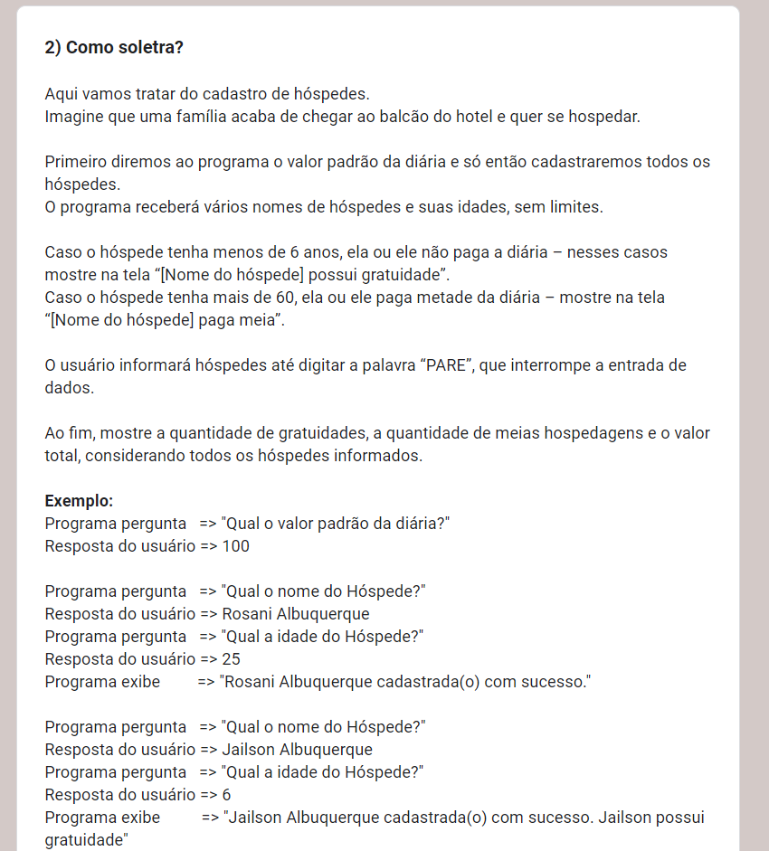
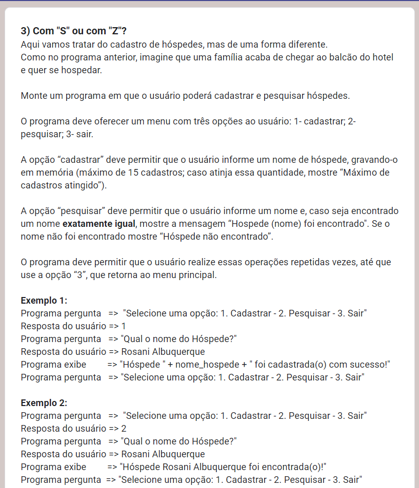
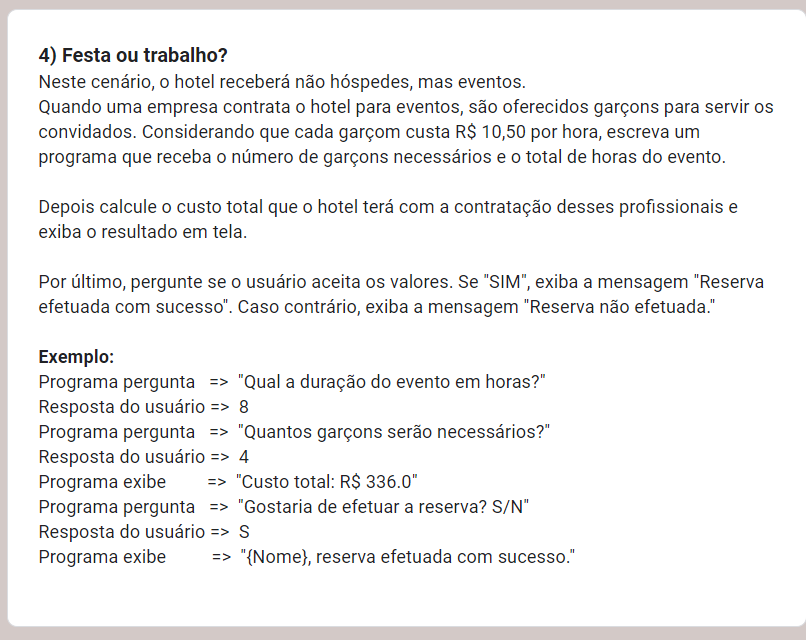
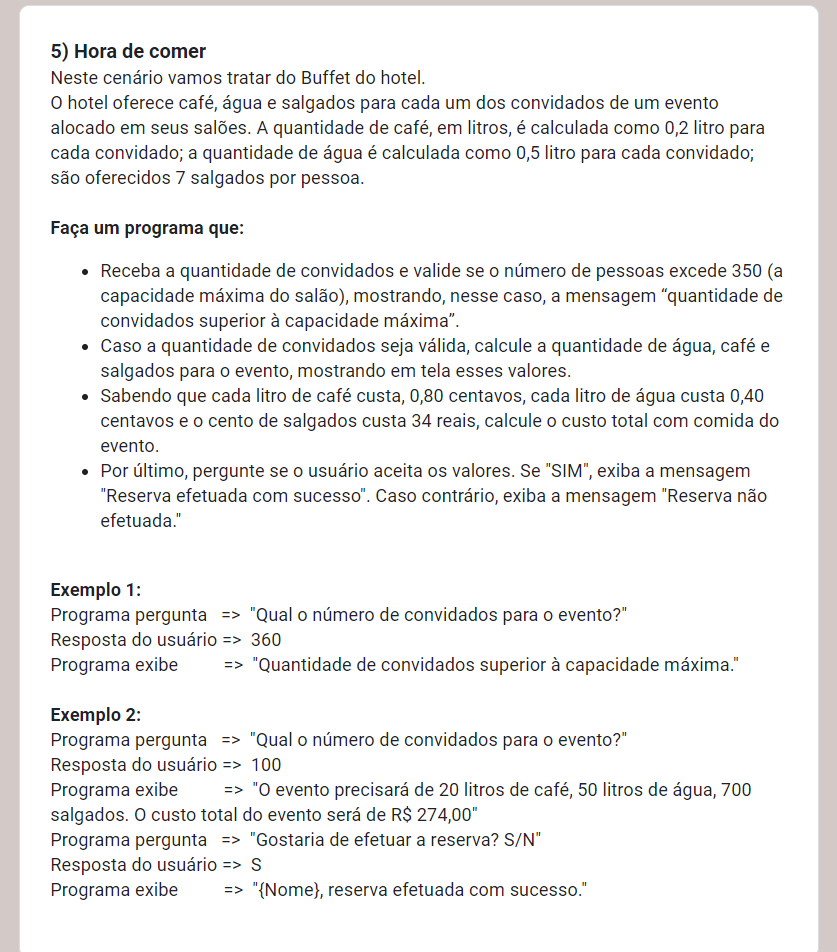
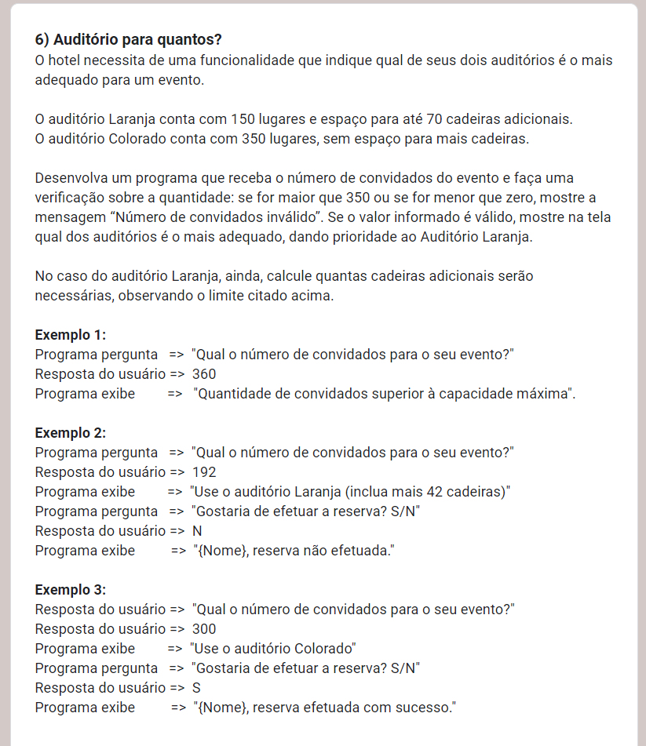
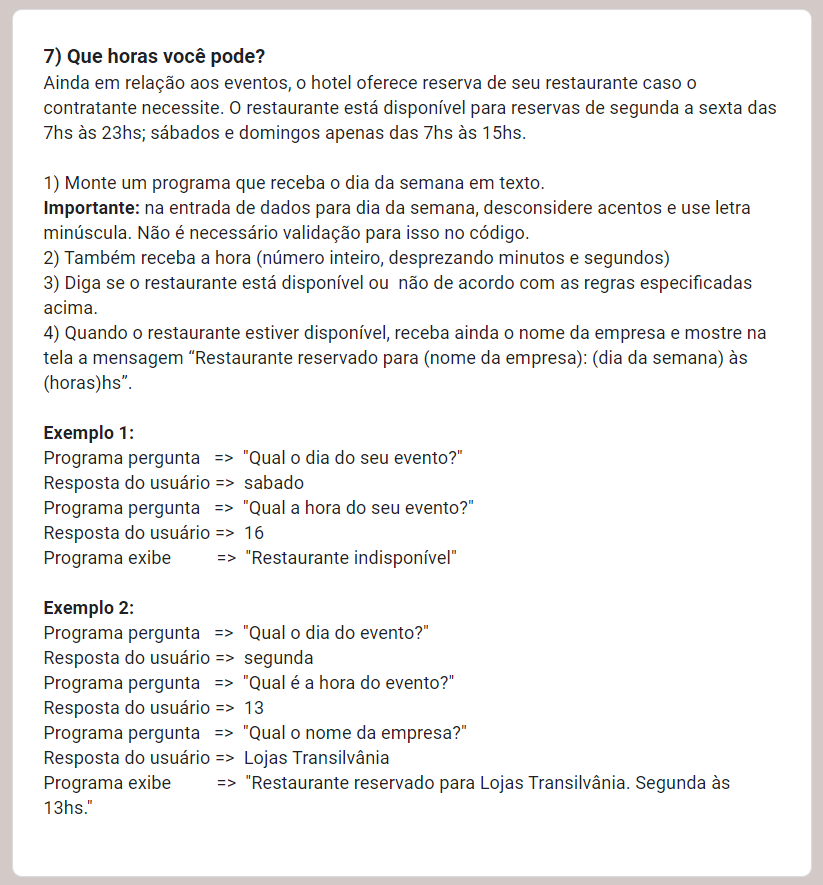
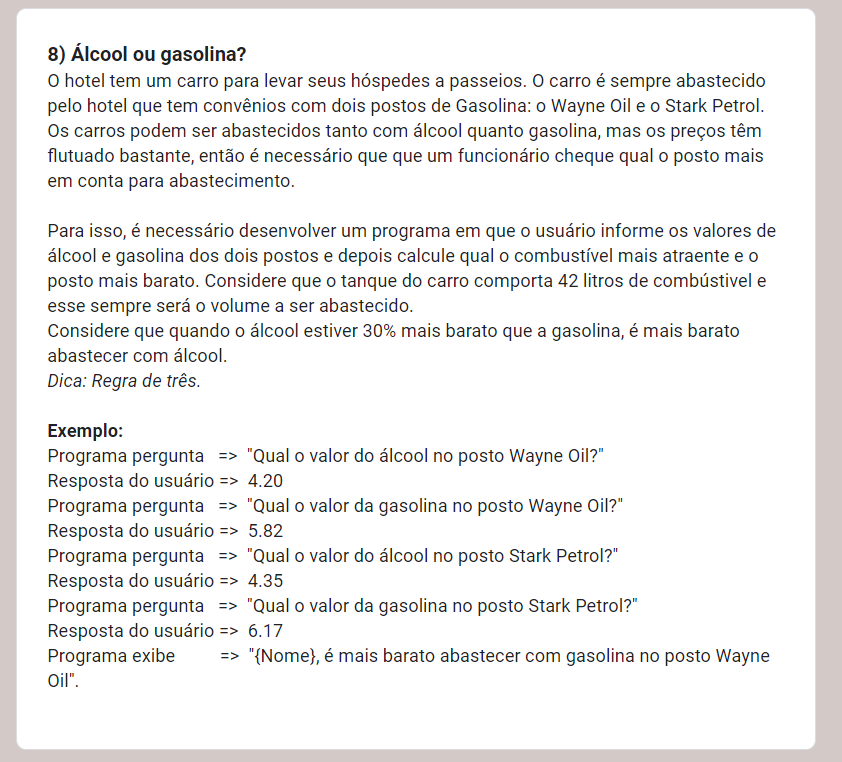
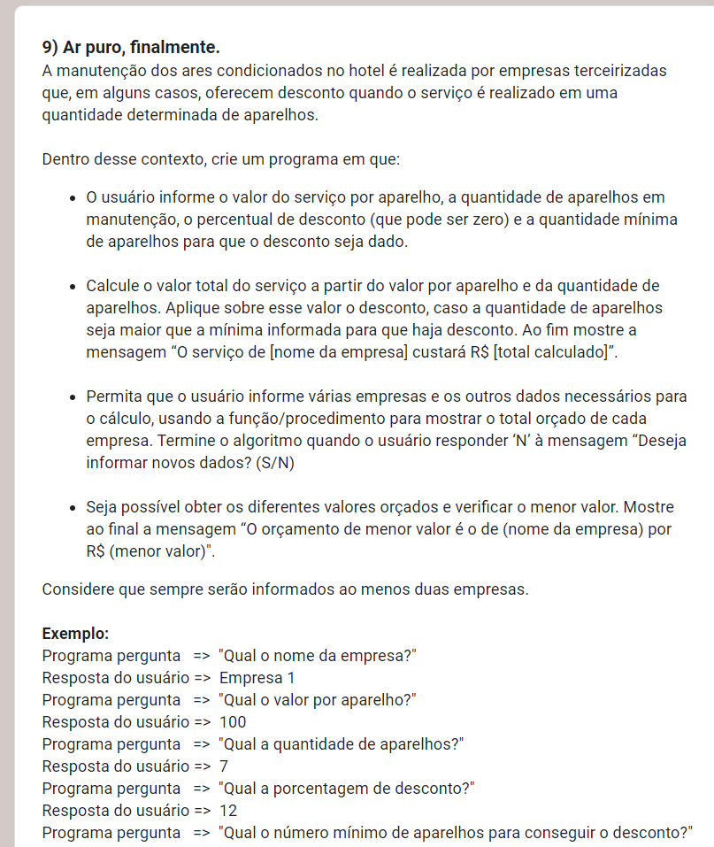

# 
Hotel Muito Louco

><h1 align = "center">Esta foi uma atividade sobre JavaScript, funções e lógica de programação, delegada pelo professor Gabriel Augusto, do Instituto PROA.</h1>

Nesta atividade nosso dever era editar um código já existente para melhorar suas funcionalidades, otimizá-lo e adicionar novas instruções e funções ao programa. O objetivo desse exercício é trabalhar nossa familiaridade com HTML e JavaScript, além também de desenvolver a lógica de programação.

## Linguagens utilizadas:
- HTML
- JavaScript

## Contato:
aronf.ramalho@gmail.com

https://www.linkedin.com/in/aronferreiraramalho/

## 
 Imagens com as instruções da atividade:

